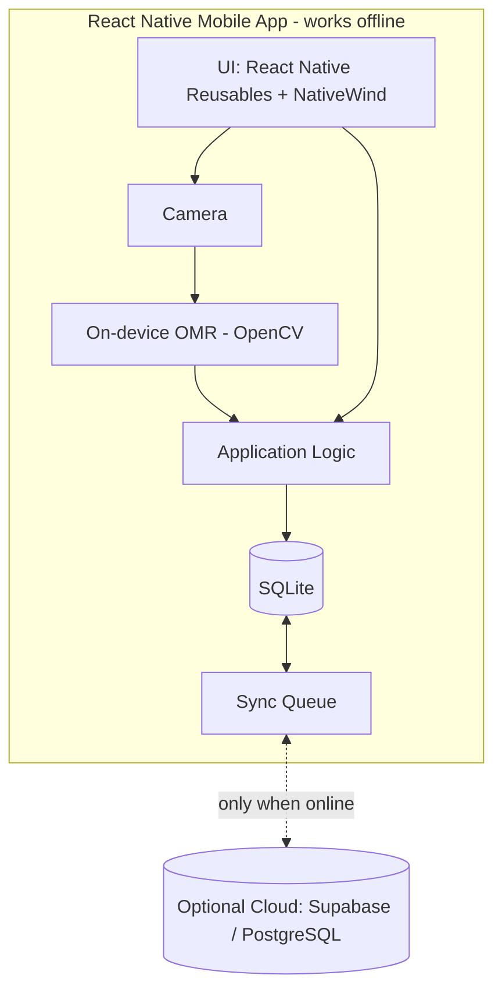
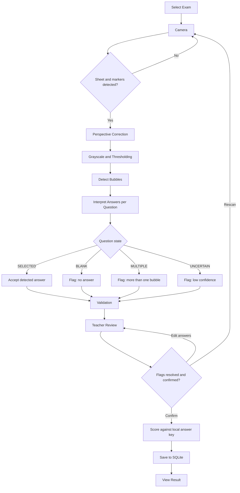
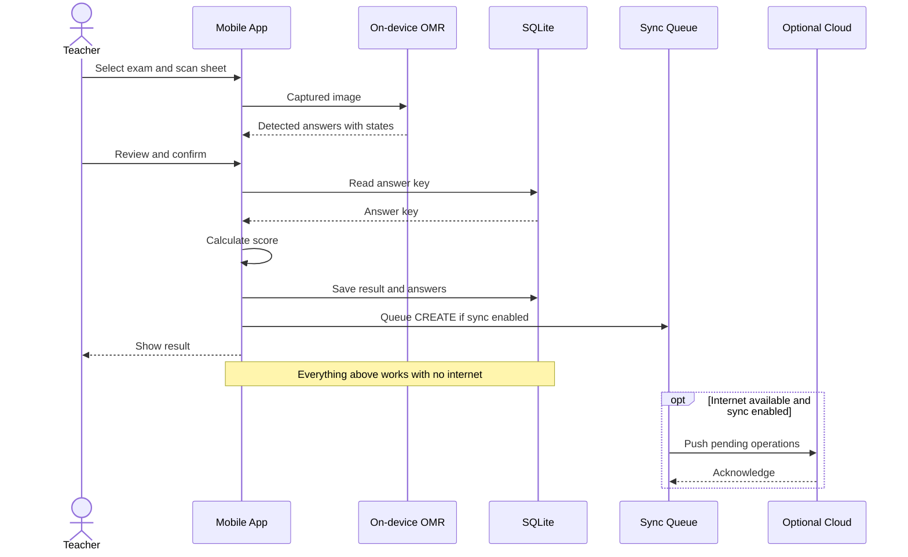
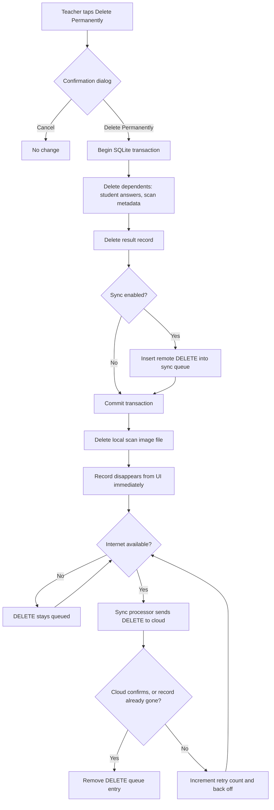
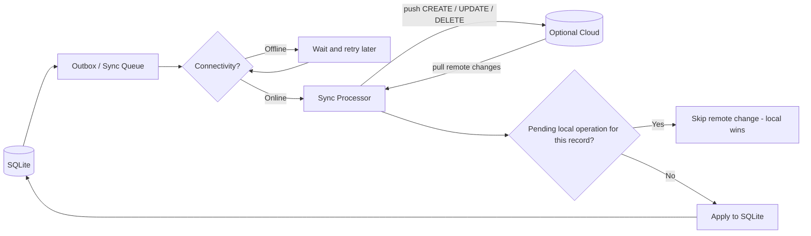
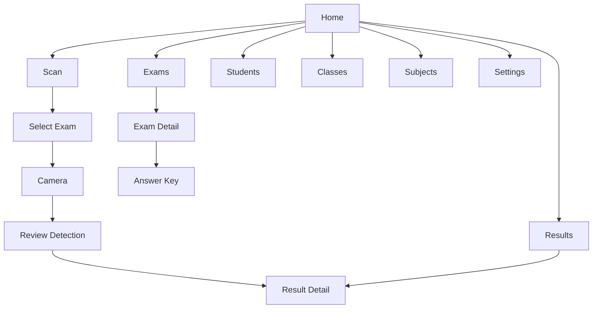
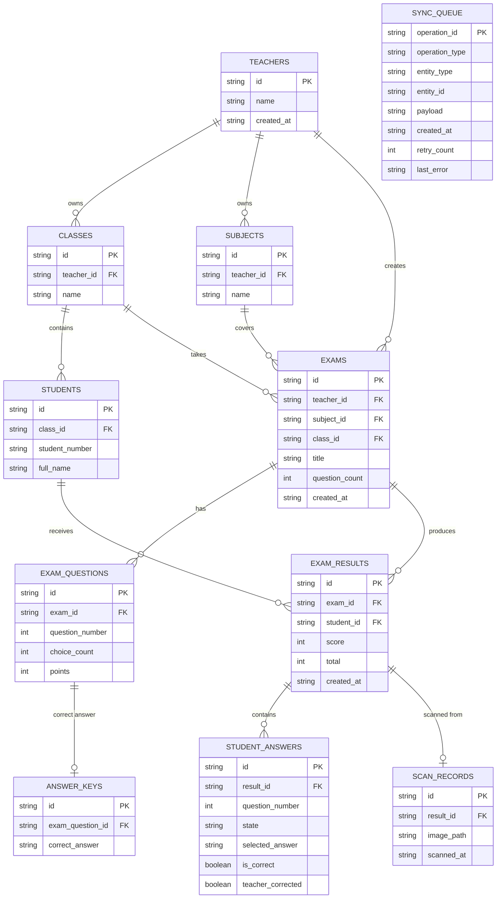

# Diagrams

Last reviewed: 2026-10-02

All diagrams show the **target** design. Nothing here is implemented yet; see [project.md](./project.md#current-implementation-status). Decisions are governed by [source-of-truth.md](./source-of-truth.md).

## High-Level Mobile Architecture

## Answer Sheet Scanning Flow

## Offline Data Flow

## Permanent Delete Flow

## Sync Architecture

## Mobile Navigation

Proposed. No navigation exists in the repository.

## Proposed Domain Model

No schema exists. This is a proposal, not a confirmed design. All `id` columns are device-generated UUIDs.

Notes:

- `SYNC_QUEUE` has no foreign keys on purpose: a `DELETE` entry must outlive the record it refers to.
- `TEACHERS` holds a single local profile row. It is not a role or permission table. Whether it is needed before authentication exists is an open decision.
- A student belonging to exactly one class is an assumption; many-to-many enrollment is an open decision.
