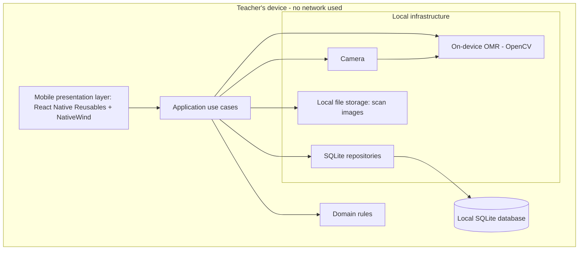
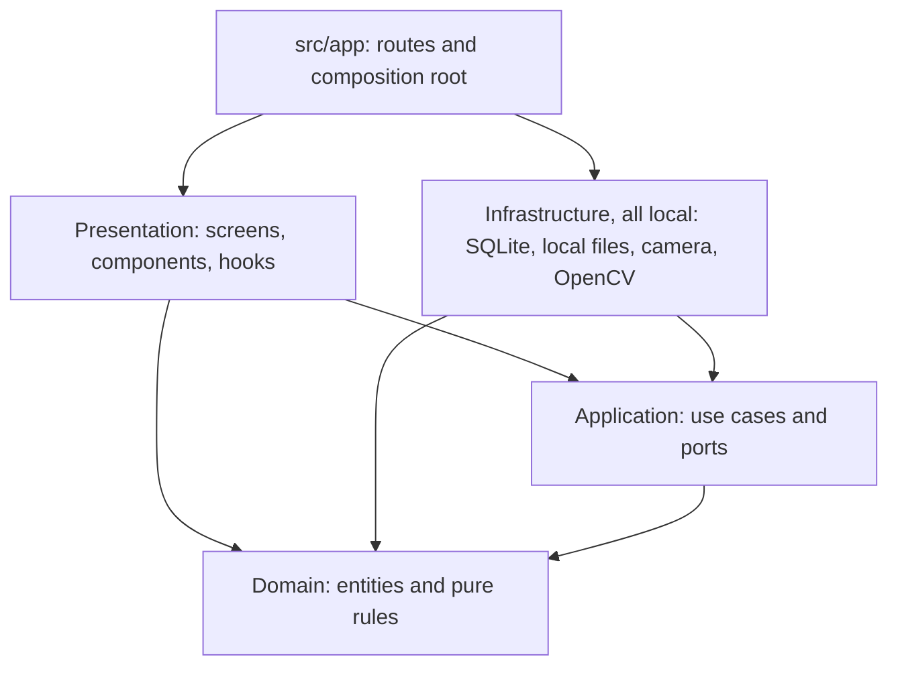
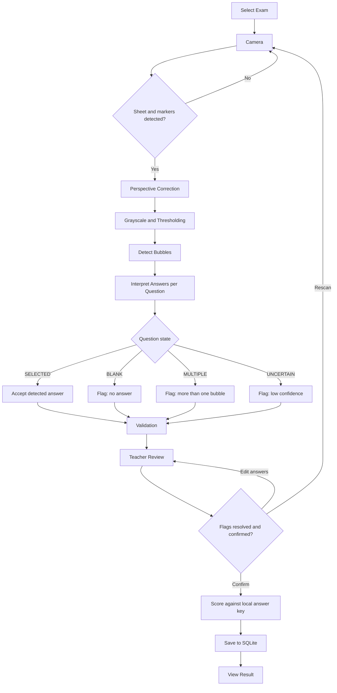
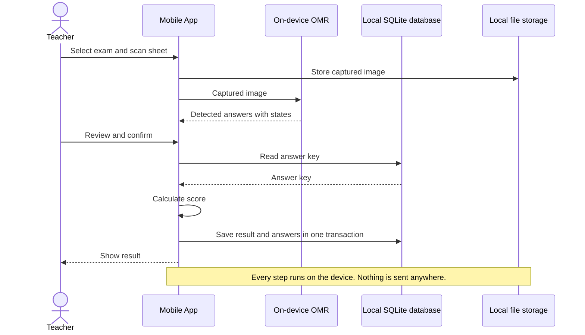
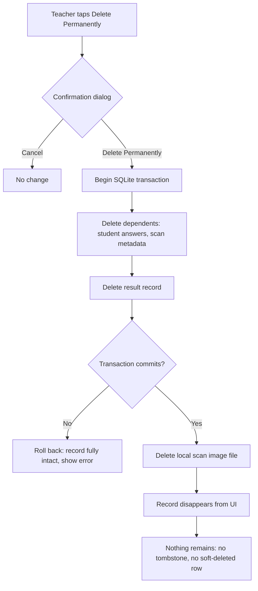
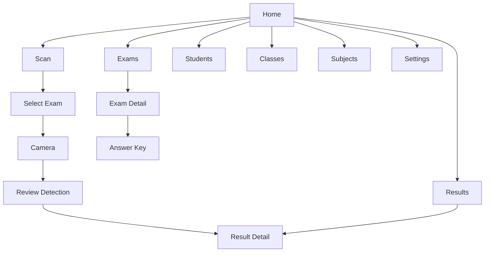
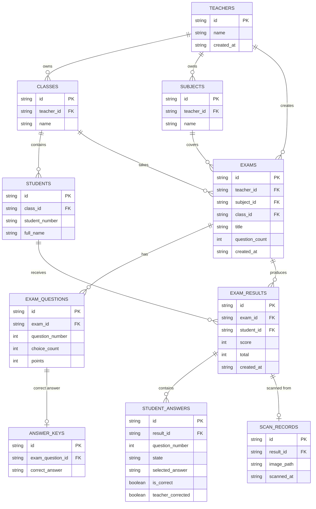

# Diagrams

Last reviewed: 2026-10-02

All diagrams show the **target** design unless marked Implemented. The application is offline-only: every component in every diagram runs on the Teacher's device, and there is no backend, cloud database, or synchronization. Only the app shell, design system, Home dashboard, placeholder screens, and SQLite bootstrap exist today; see [project.md](./project.md#current-implementation-status). Decisions are governed by [source-of-truth.md](./source-of-truth.md).

## High-Level Mobile Architecture

Everything is inside the mobile application on the Teacher's device.

## Clean Architecture Layers

Arrows show allowed import direction. Rules are in [source-of-truth.md](./source-of-truth.md#clean-architecture-layers).

## Answer Sheet Scanning Flow

## Offline Data Flow

## Permanent Delete Flow

## Mobile Navigation

Implemented: a bottom tab bar with Home, Exams, Scan, Students, and Results. Classes, Subjects, and Settings are opened from Home, not from a tab. Scan, Exams, Students, Classes, Subjects, and Results are placeholder screens; Settings has a theme switch. The nested screens (Select Exam, Camera, Review Detection, Result Detail, Exam Detail, Answer Key) are planned and do not exist.

## Proposed Domain Model

No schema exists: the local SQLite database is created with no tables. This is a proposal, not a confirmed design. All `id` columns are device-generated UUIDs. Every table is in the local SQLite database on the Teacher's device.

Notes:

- `SCAN_RECORDS.image_path` points to a file in local storage on the device.
- No table has a soft-delete or archive column. Permanent physical deletion removes rows.
- `TEACHERS` would hold a single local profile row. It is not an account, role, or permission table, and there is no sign-in. With one Teacher per installation it may be unnecessary; whether to keep it is an open decision.
- A student belonging to exactly one class is an assumption; many-to-many enrollment is an open decision.
