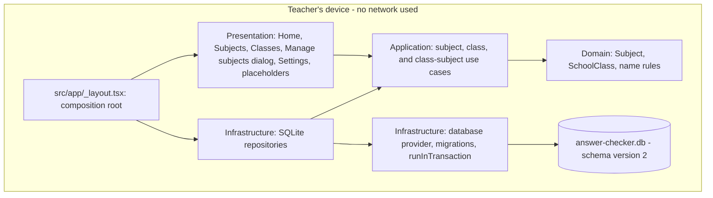
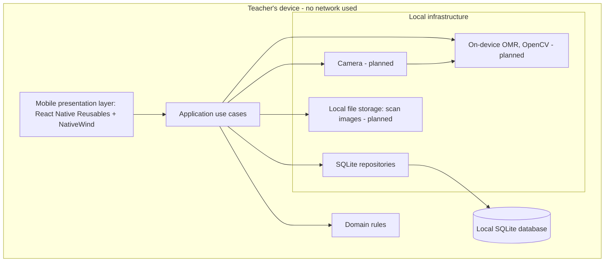
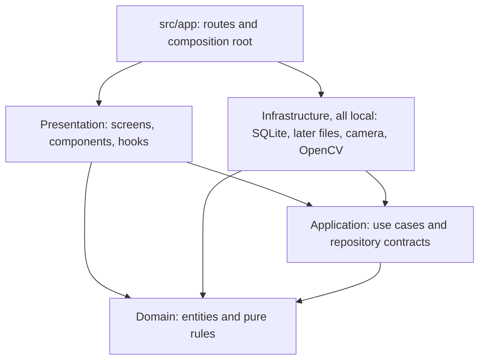
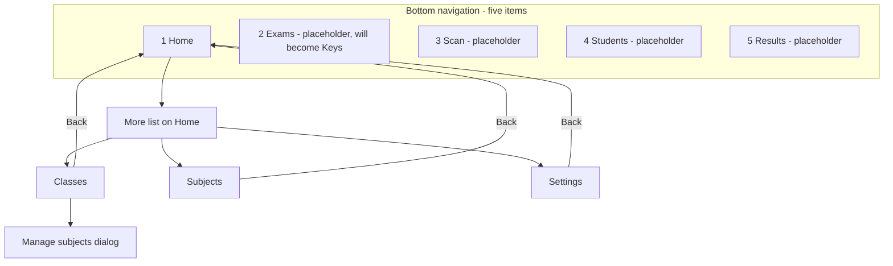
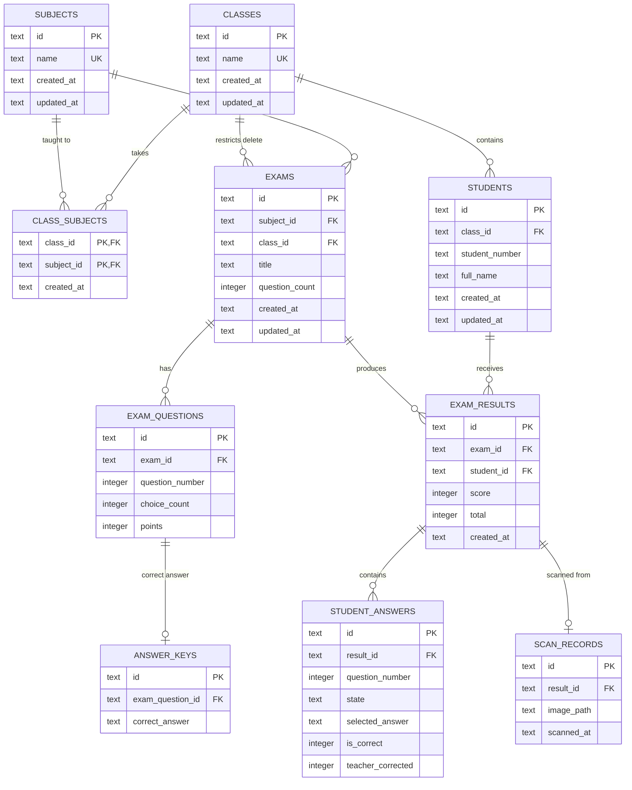
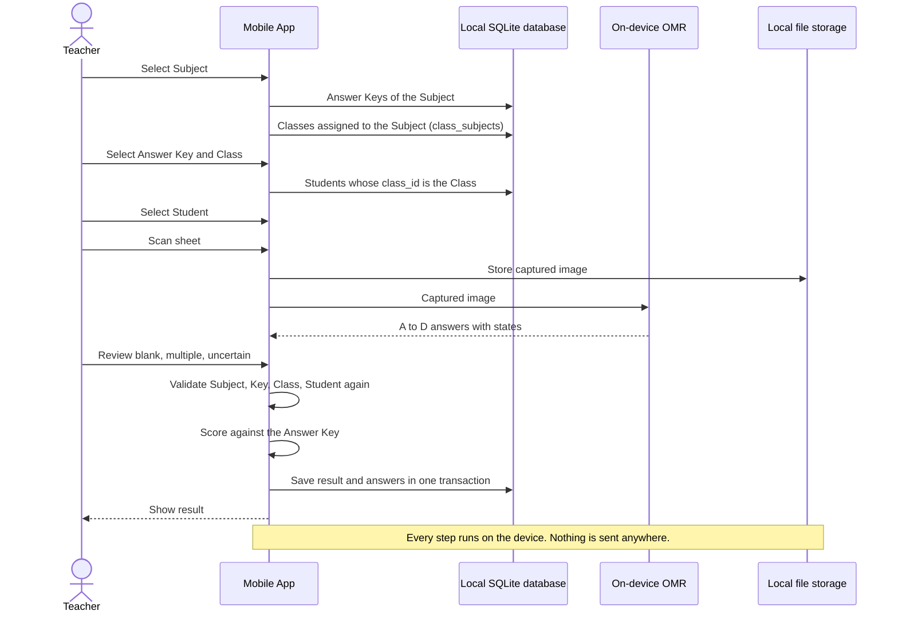
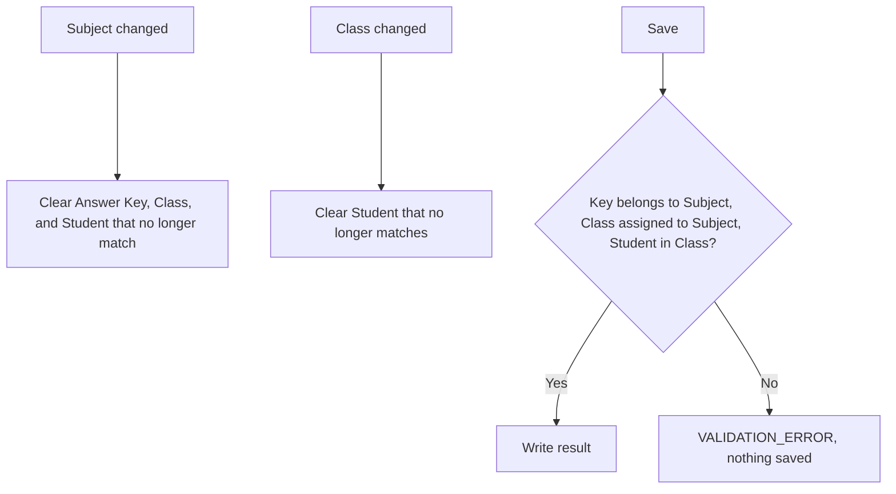
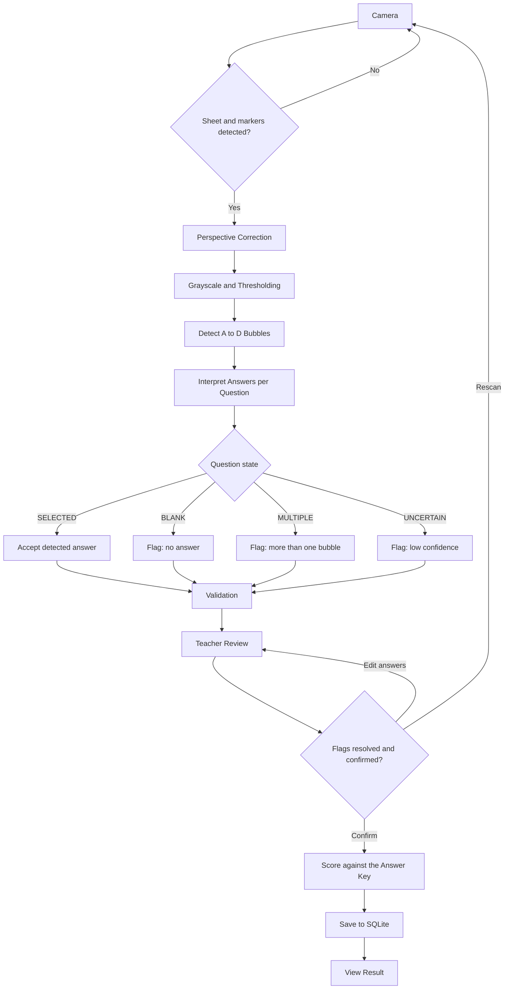
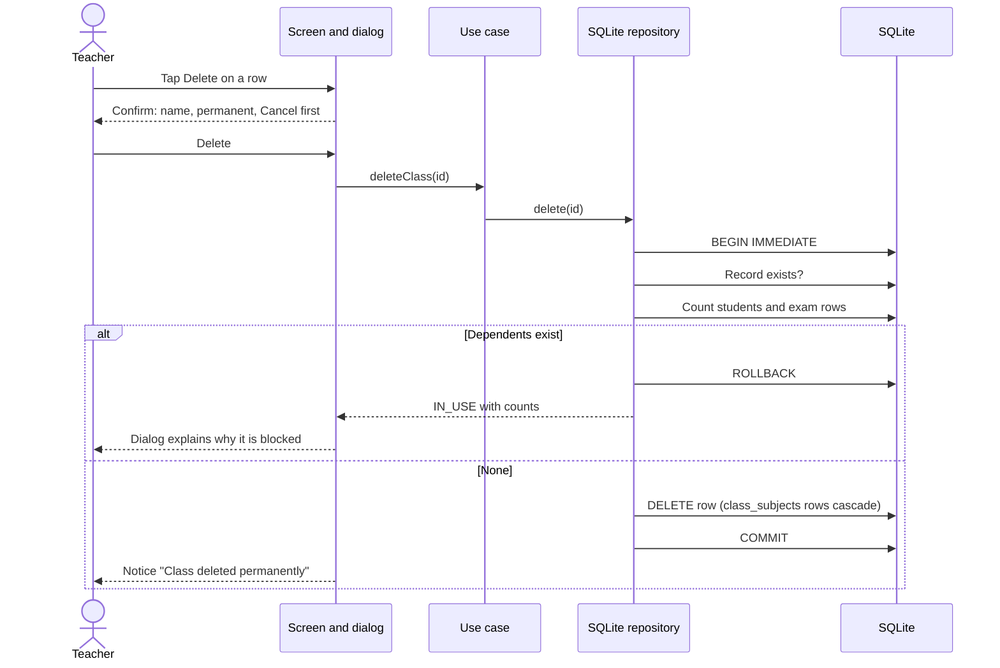
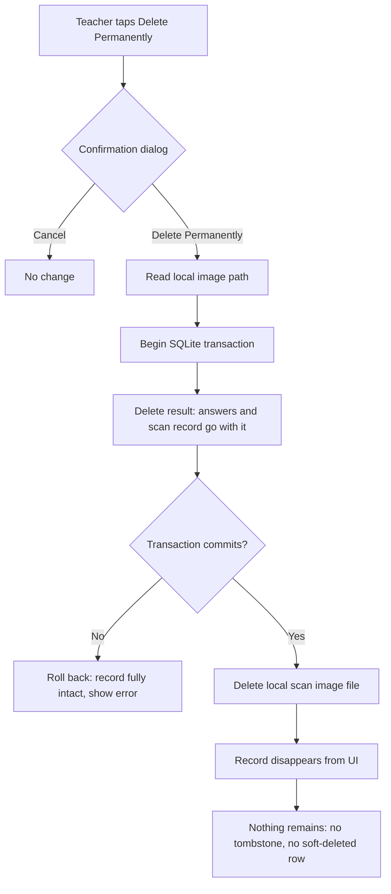

# Diagrams

Last reviewed: 2026-10-02

Each diagram is marked **Implemented** or **Planned**. The application is offline-only: every component in every diagram runs on the Teacher's device, and there is no backend, cloud database, or synchronization. Status details are in [project.md](./project.md#current-implementation-status). Decisions are governed by [source-of-truth.md](./source-of-truth.md).

## Implemented Architecture

Implemented. This is what the code contains today.



## Target Architecture

Planned. Camera, OMR, and file storage are not built.



## Clean Architecture Layers

Implemented. Arrows show allowed import direction. Rules are in [source-of-truth.md](./source-of-truth.md#clean-architecture-layers).



## Mobile Navigation

Implemented and verified on a physical Android phone. The bottom bar has exactly five items. Classes, Subjects, and Settings open from the More list on Home and are not in the bar; while one is open, Home stays selected.

"Exams" is the temporary label of a placeholder. Its approved future label is "Keys" (Answer Keys).



Planned nested screens that do not exist: Answer Key editor, Student roster and import, scan selection, Camera, Review Detection, Result Detail.

## Implemented SQLite Schema

Implemented. This is the physical schema after migrations 1 and 2 (`PRAGMA user_version` = 2). All tables are `STRICT`. All `id` columns are device-generated UUIDs. Only `subjects`, `classes`, and `class_subjects` are used by the app today.

`exams`, `exam_questions`, and `answer_keys` are the names in the database. They predate the Answer Key decision and are shown as they are; see [Planned Answer Key Model](#planned-answer-key-model).



Notes:

- Delete rules: `class_subjects`, `exam_questions`, `answer_keys`, `student_answers`, and `scan_records` are removed with their parent (CASCADE). Every other foreign key is RESTRICT. The full table is in [api.md](./api.md#foreign-keys-and-delete-rules).
- `students.student_number` is unique within a class. One result per student per exam row is enforced by a unique index.
- `scan_records.image_path` points to a file in local storage, or is null when no image was kept.
- There is no teacher, account, role, or synchronization table, and no soft-delete or archive column.

## Planned Answer Key Model

Planned. This is the approved product model, not the current schema. It requires a migration that does not exist yet.

```mermaid
erDiagram
    SUBJECT ||--o{ ANSWER_KEY : has
    ANSWER_KEY ||--|{ KEY_ANSWER : "one per question"
    SUBJECT ||--o{ CLASS_SUBJECT : "taught to"
    CLASS ||--o{ CLASS_SUBJECT : takes
    CLASS ||--o{ STUDENT : contains
    ANSWER_KEY ||--o{ RESULT : "scored with"
    STUDENT ||--o{ RESULT : receives

    ANSWER_KEY {
        text id PK
        text subject_id FK
        text name
        integer question_count
    }
    KEY_ANSWER {
        integer question_number
        text correct_answer "A, B, C, or D"
    }
```

Differences from the implemented schema:

- An Answer Key belongs to a Subject only. Today `exams.class_id` is required.
- An Answer Key is reused across Classes; the Class is chosen at scan time and reaches the Result through the Student.
- No question text, choice text, or exam content is stored.
- Table and column names for this model are not decided.

## Planned Scanning Sequence

Planned. Nothing here is built except `listSubjects` and `listClassesForSubject`.



Selection rules:



## Planned OMR Flow

Planned.



## Permanent Deletion: Subject or Class

Implemented and verified on a physical Android phone.



## Permanent Deletion: Result

Planned.


