# Diagrams

Last reviewed: 2026-10-02

Each diagram is marked **Implemented** or **Planned**. The application is offline-only: every component in every diagram runs on the Teacher's device, and there is no backend, cloud database, or synchronization. Status details are in [project.md](./project.md#current-implementation-status). Decisions are governed by [source-of-truth.md](./source-of-truth.md).

## Implemented Architecture

Implemented. This is what the code contains today.

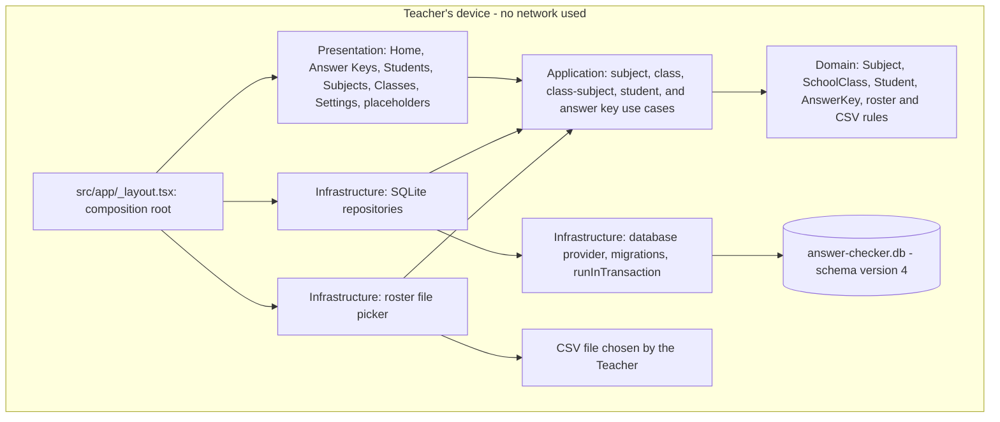

## Target Architecture

Planned. Camera, OMR, and scan-image storage are not built.

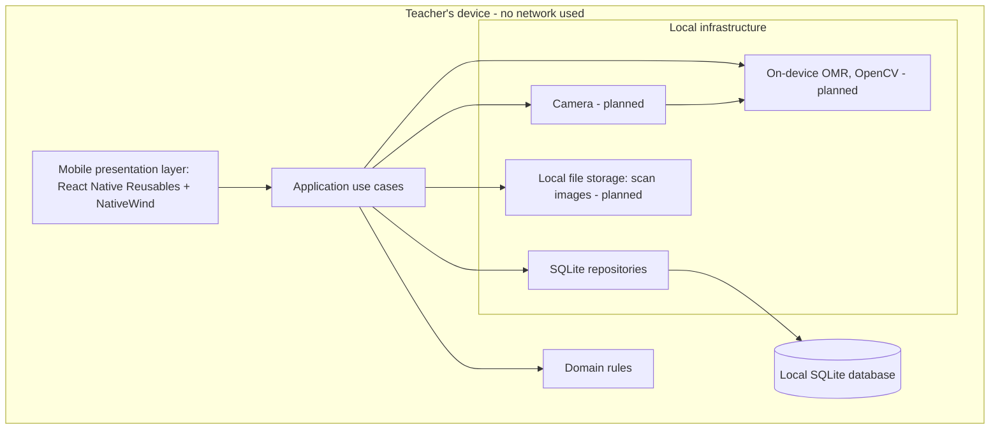

## Clean Architecture Layers

Implemented. Arrows show allowed import direction. Rules are in [source-of-truth.md](./source-of-truth.md#clean-architecture-layers).

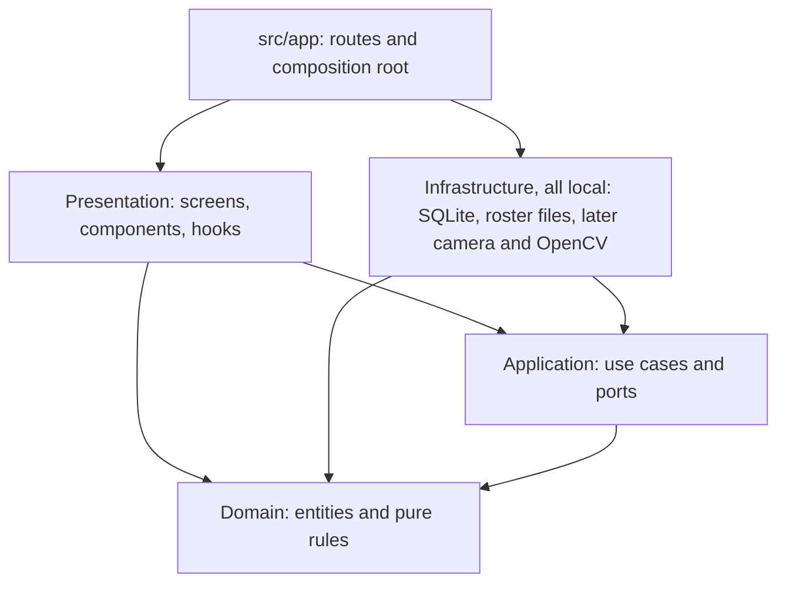

## Mobile Navigation

Implemented and verified on a physical Android phone. The bottom bar has exactly five items. Classes, Subjects, and Settings open from the More list on Home and are not in the bar; while one is open, Home stays selected. There is no Exams tab.

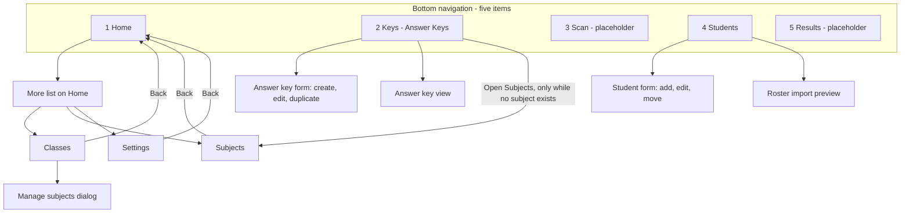

Planned nested screens that do not exist: scan selection, Camera, Review Detection, Result Detail.

## Implemented SQLite Schema

Implemented. This is the physical schema after migrations 1 to 4 (`PRAGMA user_version` = 4). All tables are `STRICT`. All `id` columns are device-generated UUIDs. There is no exam table: migration 4 converted `exams`, `exam_questions`, and the old per-question `answer_keys` into the tables below.

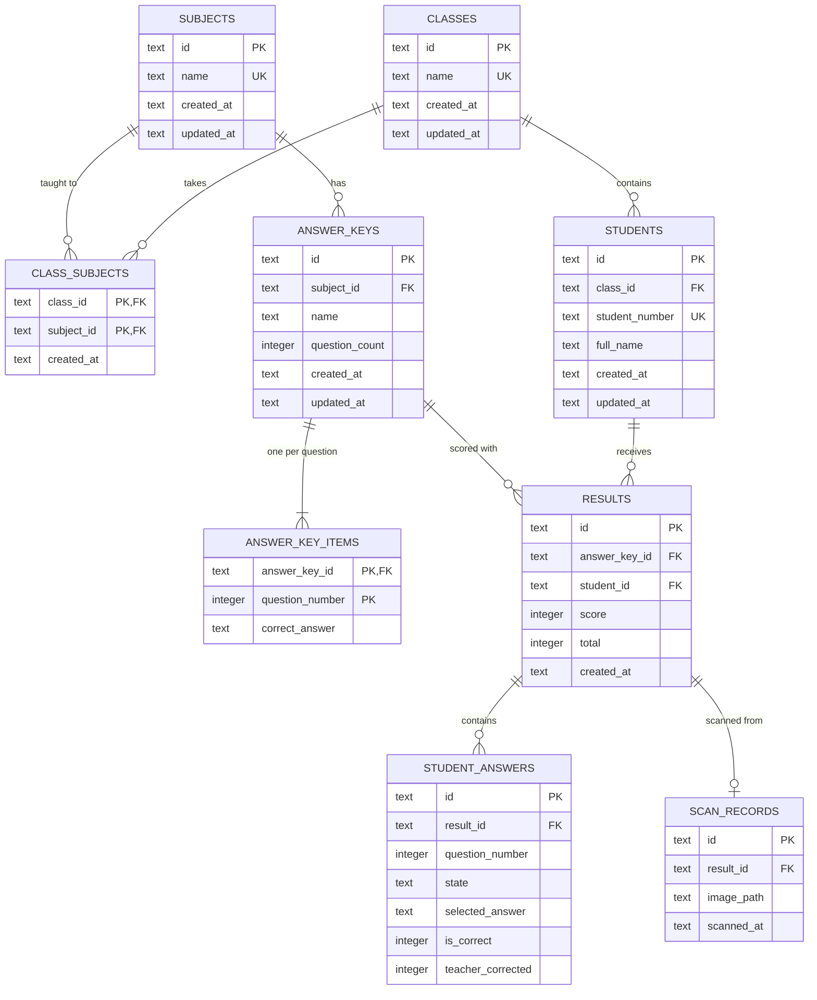

Notes:

- Delete rules: `class_subjects`, `answer_key_items`, `student_answers`, and `scan_records` are removed with their parent (CASCADE). Every other foreign key is RESTRICT. The full table is in [api.md](./api.md#foreign-keys-and-delete-rules).
- An Answer Key has a Subject and no Class. The Class reaches a Result through the Student.
- `students.student_number` is the Student ID and is unique in the whole app, ignoring letter case. An Answer Key name is unique within its Subject. One result per student per answer key is enforced by a unique index.
- `question_count` and `question_number` are 1 to 40; `correct_answer` is A, B, C, or D.
- `scan_records.image_path` points to a file in local storage, or is null when no image was kept.
- `results`, `student_answers`, and `scan_records` hold no rows yet: nothing saves a result until scanning exists.
- There is no teacher, account, role, or synchronization table, and no soft-delete or archive column.

## Roster Import

Implemented and verified on a physical Android phone.

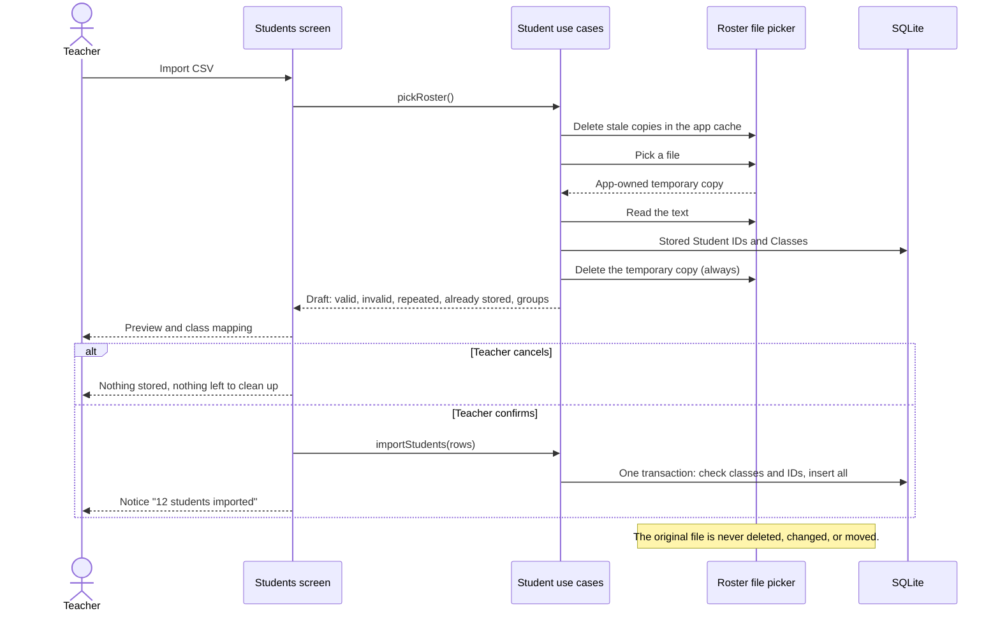

## Answer Key Editing Rule

Implemented. The locked path is covered by tests; it cannot be reached on a phone until Results exist.

## Planned Scanning Sequence

Planned. The four selection reads exist; nothing from "Scan sheet" onward is built.

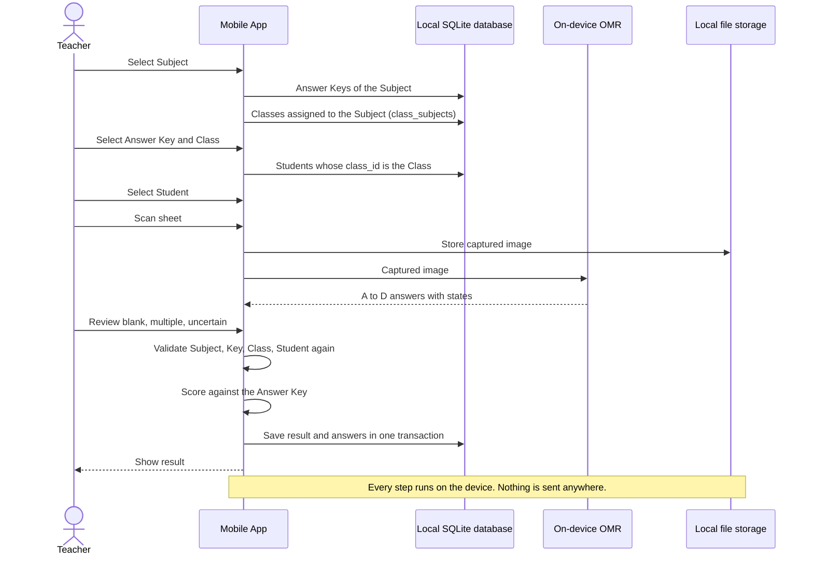

Selection rules:

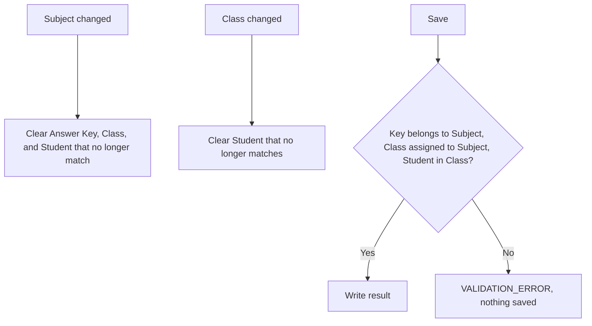

## Planned OMR Flow

Planned.

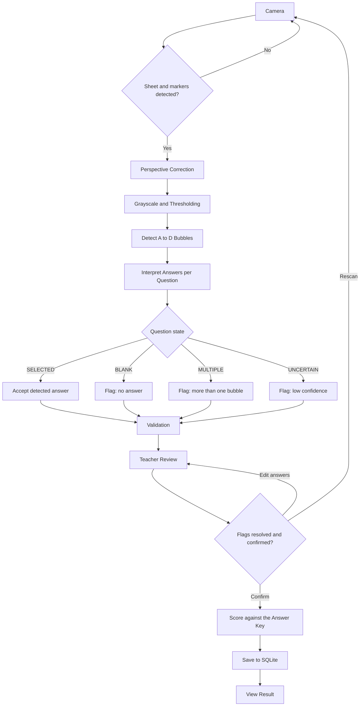

## Permanent Deletion: Blocked or Deleted

Implemented for Subjects, Classes, Students, and Answer Keys. The diagram shows an Answer Key; the others differ only in what is counted.

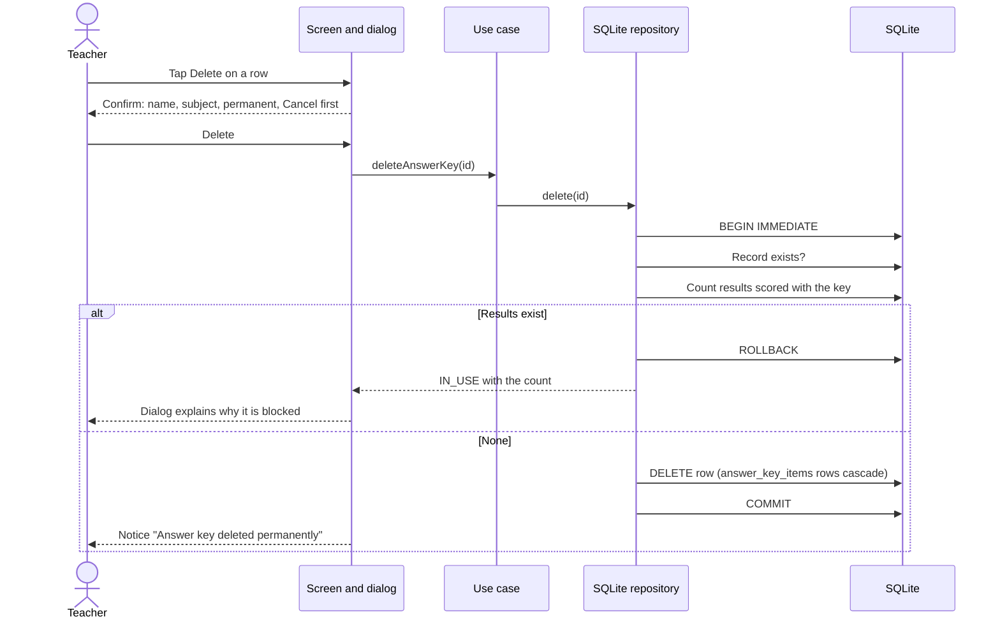

| Deleting | Counted before deleting |
| --- | --- |
| Subject | Answer Keys of the subject |
| Class | Students of the class |
| Student | Results of the student |
| Answer Key | Results scored with the key |

## Permanent Deletion: Result

Planned.

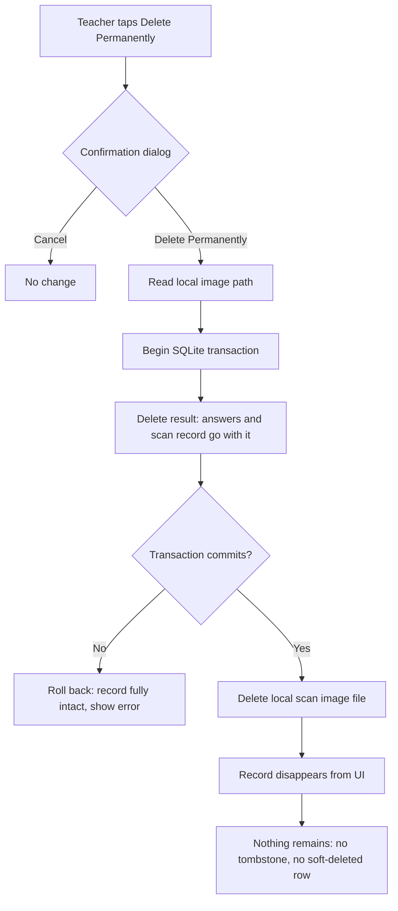
