# Diagrams

Last reviewed: 2026-10-02

Each diagram is marked **Implemented** or **Planned**. The application is offline-only: every component in every diagram runs on the Teacher's device, and there is no backend, cloud database, or synchronization. Status details are in [project.md](./project.md#current-implementation-status). Decisions are governed by [source-of-truth.md](./source-of-truth.md).

## Implemented Architecture

Implemented. This is what the code contains today.

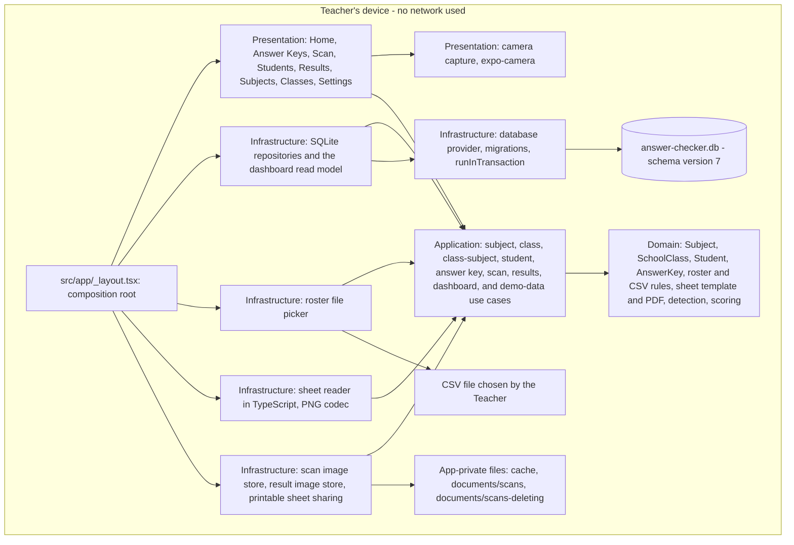

## Target Architecture

The implemented architecture above is the target architecture: every layer and every local component it names exists.

## Clean Architecture Layers

Implemented. Arrows show allowed import direction. Rules are in [source-of-truth.md](./source-of-truth.md#clean-architecture-layers).

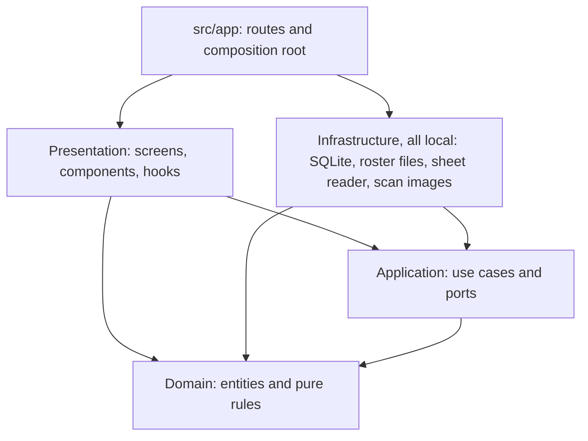

## Mobile Navigation

Implemented and verified on a physical Android phone. The bottom bar has exactly five items. Classes, Subjects, and Settings open from the More list on Home and are not in the bar; while one is open, Home stays selected. There is no Exams tab.

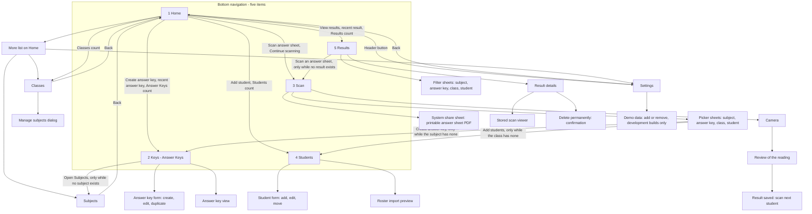

The pickers, the camera, the review, the Result details, and the scan viewer are sheets and full-screen dialogs over their screen, not routes.

## Implemented SQLite Schema

Implemented. This is the physical schema after migrations 1 to 7 (`PRAGMA user_version` = 7). All tables are `STRICT`. All `id` columns are device-generated UUIDs. There is no exam table: migration 4 converted `exams`, `exam_questions`, and the old per-question `answer_keys` into the tables below.

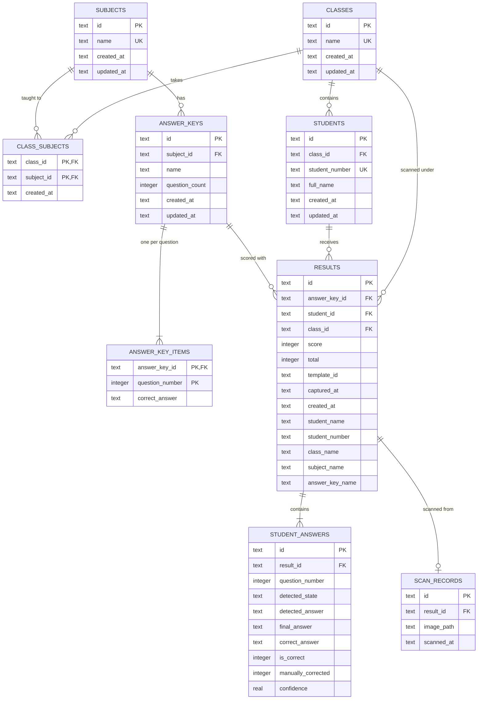

Notes:

- Delete rules: `class_subjects`, `answer_key_items`, `student_answers`, and `scan_records` are removed with their parent (CASCADE). Every other foreign key is RESTRICT. The full table is in [api.md](./api.md#foreign-keys-and-delete-rules).
- An Answer Key has a Subject and no Class. A Result records the Class the Student was in when the sheet was scanned (`results.class_id`, RESTRICT), so it stays under that Class if the Student moves later.
- `students.student_number` is the Student ID and is unique in the whole app, ignoring letter case. An Answer Key name is unique within its Subject.
- A Student may have several Results with one Answer Key: each scan is a separate attempt. The index on `(answer_key_id, student_id)` is not unique.
- `question_count` and `question_number` are 1 or more, with no upper limit in the database; `correct_answer` is A, B, C, or D.
- `student_answers.detected_state` is `MARKED`, `BLANK`, `MULTIPLE`, or `UNCLEAR`. `detected_answer` is what the reader read, `final_answer` what was scored after the Teacher's review (null is a blank), and `correct_answer` the key's letter at the time of scoring. `is_correct` must agree with the last two.
- `results.template_id` names the sheet that was read, for example `AC-10-V2`. `captured_at` is when the photo was taken, `created_at` when the Result was saved.
- `scan_records.image_path` is the path of the Result's one image, relative to the app's documents folder, for example `scans/<result id>.png`.
- `results.student_name`, `student_number`, `class_name`, `subject_name`, and `answer_key_name` are the names the Result was saved under. They are what a Result displays; the ID columns are what the filters and the delete rules use.
- The Results list is read through the index on `(captured_at, created_at, id)`.
- `results`, `student_answers`, and `scan_records` are written by Scan and read and deleted by Results. A saved row is never updated.
- There is no teacher, account, role, or synchronization table, and no soft-delete or archive column.

## Roster Import

Implemented and verified on a physical Android phone.

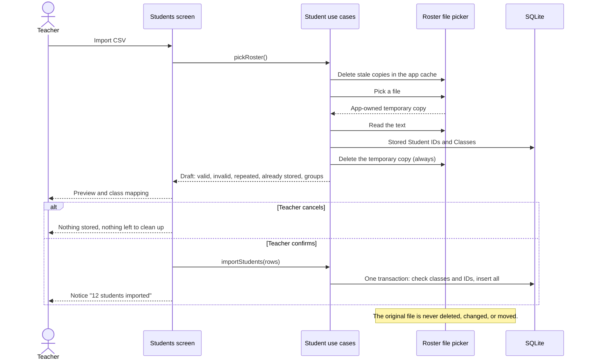

## Answer Key Editing Rule

Implemented. The locked path is covered by tests and is reachable on the phone now that Scan saves Results.

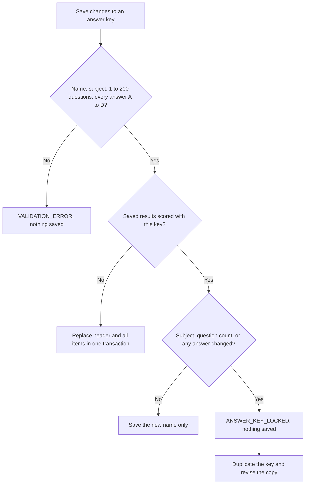

## Scanning Sequence

Implemented and verified on a physical Android phone.

```mermaid
sequenceDiagram
    actor Teacher
    participant UI as Scan screen
    participant UC as Scan use cases
    participant DB as Local SQLite database
    participant OMR as Sheet reader
    participant Files as Scan image store

    Teacher->>UI: Select Subject
    UI->>UC: listOptions(selection)
    UC->>DB: Answer Keys of the Subject, Classes assigned to it
    Teacher->>UI: Select Answer Key and Class
    UC->>DB: Students of the Class, with how often each was scanned with the key
    Teacher->>UI: Select Student
    Teacher->>UI: Open camera, take the photo
    UI->>UC: readCapture(photo, selection)
    UC->>DB: Validate Subject, Key, Class, Student
    UC->>Files: Load the photo as grayscale at working size
    UC->>OMR: Photo and the template for the key's question count
    alt Photo cannot be trusted
        OMR-->>UC: Refused with a reason
        UC->>Files: Delete the photo
        UI-->>Teacher: What to change, Retake
    else Read
        OMR-->>UC: One decision per question, flattened sheet
        UC->>Files: Write the flattened sheet as a preview, delete the photo
        UI-->>Teacher: Review: sheet picture, answers, score so far
    end
    Teacher->>UI: Decide blank, multiple, unclear; correct if needed; Save
    UI->>UC: saveResult(draft, review)
    UC->>DB: Validate the selection again; key unchanged?
    UC->>DB: Earlier Results of this Student with this key?
    opt Earlier Result exists and not yet confirmed
        UI-->>Teacher: Confirm a second, separate attempt
    end
    UC->>Files: Move the preview to documents/scans/<result id>.png
    UC->>DB: One transaction: result, answers, scan record
    opt Transaction fails
        UC->>Files: Delete the moved image
    end
    UI-->>Teacher: Score, Scan next student
    Note over UI,Files: Every step runs on the device. Nothing is sent anywhere.
```

Selection rules:

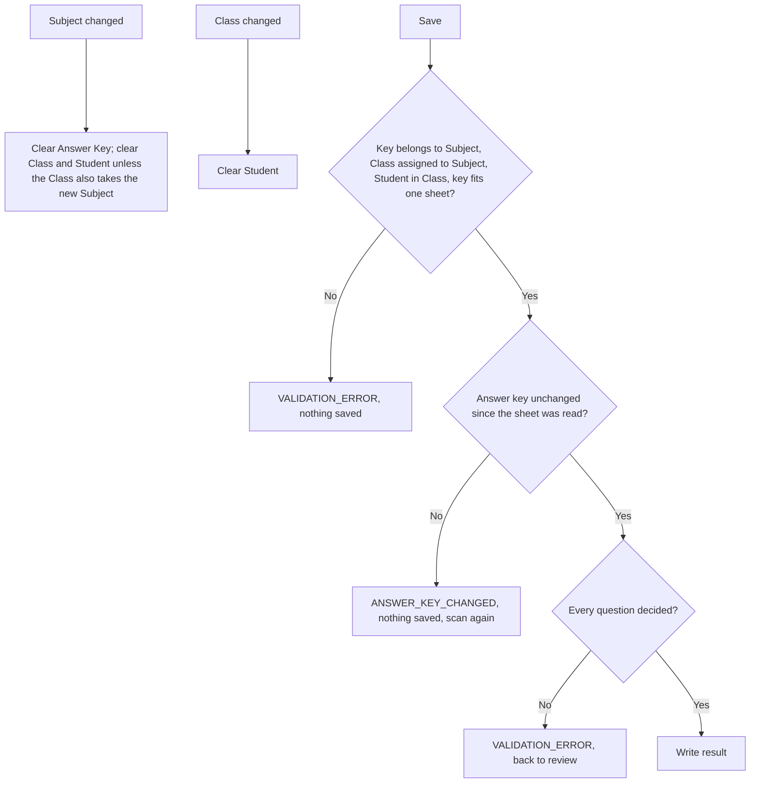

## Answer Sheet Generation

Implemented. One template serves the printed sheet and the reader.

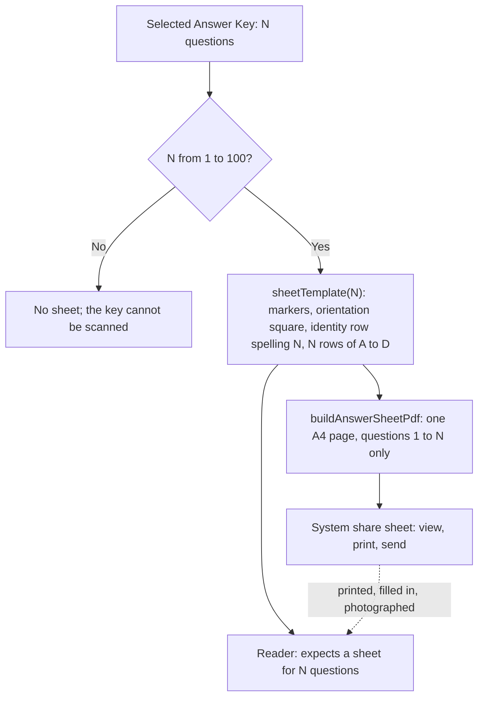

## OMR Flow

Implemented.

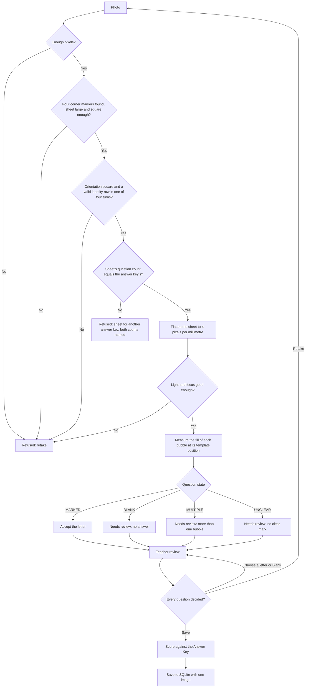

## Permanent Deletion: Blocked or Deleted

Implemented for Subjects, Classes, Students, and Answer Keys. The diagram shows an Answer Key; the others differ only in what is counted.

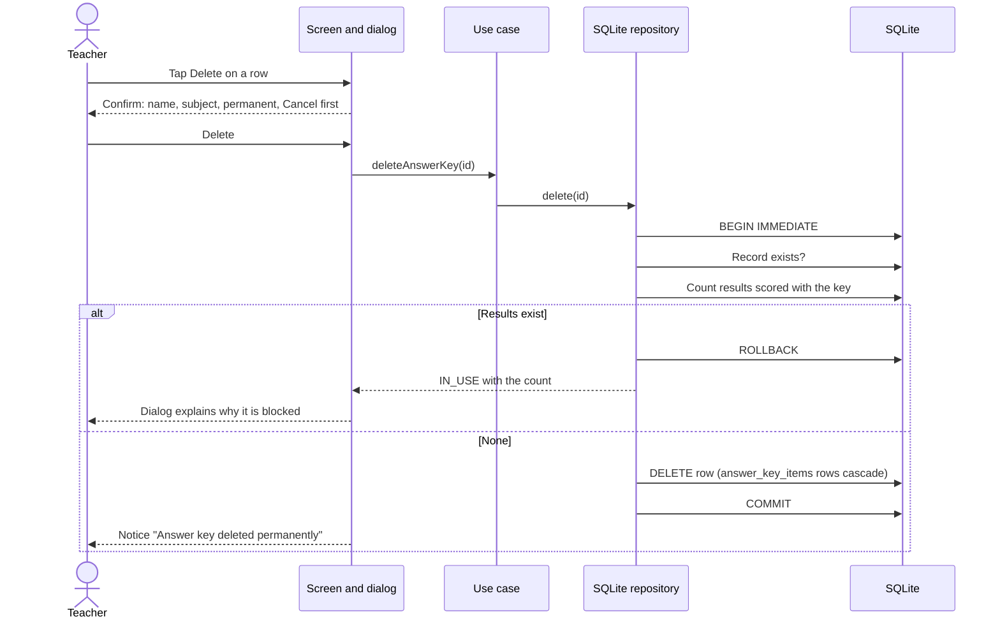

| Deleting | Counted before deleting |
| --- | --- |
| Subject | Answer Keys of the subject |
| Class | Students of the class, and Results scanned under it |
| Student | Results of the student |
| Answer Key | Results scored with the key |

## Home Dashboard

Implemented and verified on a physical Android phone.

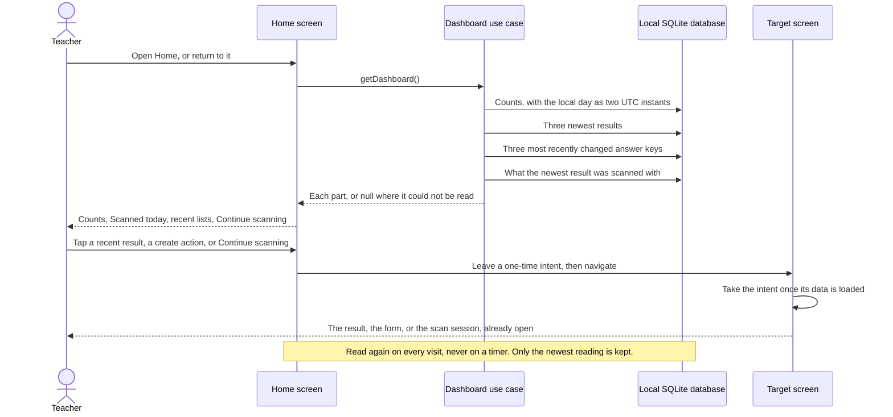

## Results Browsing

Implemented and verified on a physical Android phone.

```mermaid
sequenceDiagram
    actor Teacher
    participant UI as Results screen
    participant UC as Results use cases
    participant DB as Local SQLite database
    participant Files as Result image store

    Teacher->>UI: Open Results
    UI->>UC: settleInterruptedDeletions()
    UI->>UC: listResults, countResults, listFilterLinks
    UC->>DB: One page newest first, the counts, the filter combinations
    UI-->>Teacher: Rows: student, class, answer key, subject, score, date, attempt
    Teacher->>UI: Type in search, or choose a filter
    UI->>UC: listResults with the filter and the search
    Teacher->>UI: Scroll to the end
    UI->>UC: listResults after the last row
    Teacher->>UI: Open a row
    UI->>UC: getResult(id)
    UC->>DB: Result, answers in question order, image path
    UC->>Files: Is the image a scan image, and is it there?
    UI-->>Teacher: Details, read-only; the scan, or "Stored scan image is unavailable"
    Note over UI,Files: No image is loaded for the list. Nothing can be edited.
```

## Permanent Deletion: Result

Implemented and verified on a physical Android phone.

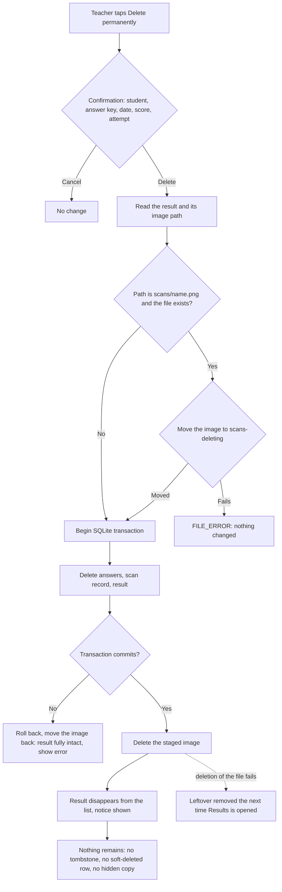
